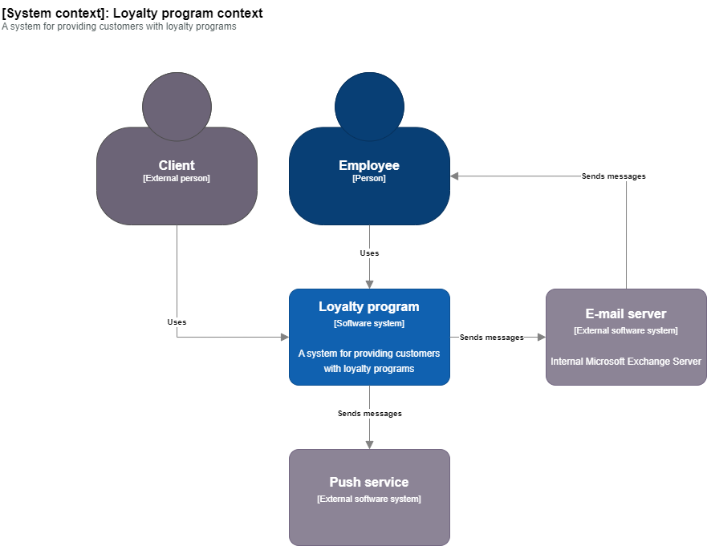
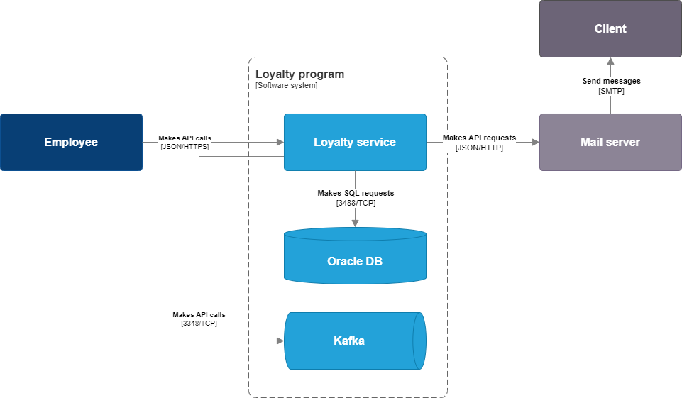

# C4 Model draw.io template

This repository contains a draw.io template for creating C4 Model diagrams. Also it includes a stencil with C4 Model shapes.

# How to use
You can use this template in two ways:
1) Download the template and open it in draw.io
2) Download the stencil and import it into your current draw.io diagram

## Stencil
 Here is the link to download C4 stencil - [C4 Model Stencil](c4_stencil.xml)

Steps to import the stencil into draw.io:
1. Download the stencil file.
2. Open your diagram in draw.io.
3. Click on `File` -> `Open Library` -> `Downloaded stencil file`

## Template
This is a draw.io template for creating C4 Model diagrams  - [C4 Model Template](https://raw.githubusercontent.com/vadagama/c4-model-drawio-template/main/c4.drawio)

The template includes the following:
1. **context** - Context diagram
3. **container** - Container diagram
4. **component** - Component diagram
5. **deployment** - Deployment diagram
6. **minimal** - Minimalistic C4 diagram without descriptions and technology details
7. **shapes** - all C4 Model shapes on one page

3. Download the template and open it in draw.io. When you open the template, you will see a list of diagrams. Click on the diagram you want to create and start editing.

# Context diagram
The context diagram is the highest level of abstraction and is a starting point for the C4 Model. It shows the system in scope and its interactions with external systems.

# Container diagram
The container diagram shows the high-level technology choices and how the containers communicate with each other.

# Component diagram
The component diagram shows the internal structure of a container and how the components inside it interact with each other.

# Deployment diagram
The deployment diagram shows how the containers are deployed on the infrastructure.

# Minimalistic C4 diagram
Minimalistic C4 diagram without descriptions and technology details. This diagram is useful when you want to show the high-level structure of the system without going into details. Please don't forget to add descriptions and technology details in the table below the diagram.

# Examples 
Here are some examples of C4 diagrams created with this template:
- [Food delivery system design](https://github.com/vadagama/food-delivery-system-design)
- [Content sales system design](https://github.com/vadagama/content-sales-system-design)
- [Industrial IoT system design](https://github.com/vadagama/industrial-iot-system-design)
- [Integrated cognitive system design](https://github.com/vadagama/industrial-iot-system-design)